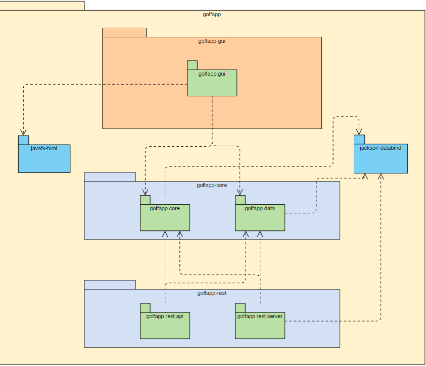
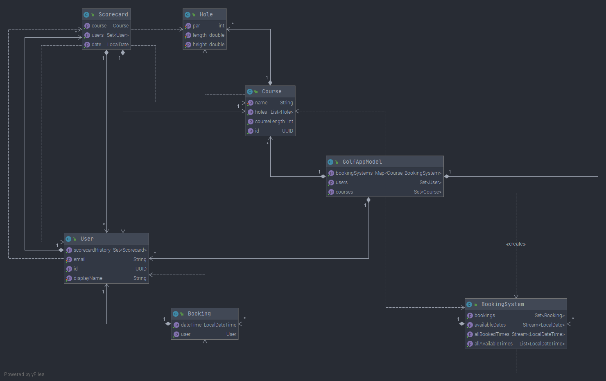
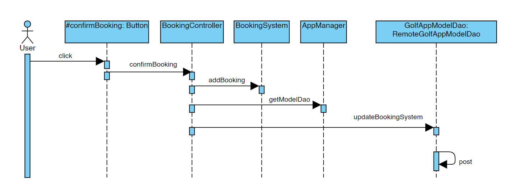

## Module and package structure

Golf App consists of three Maven modules, with each module containing one or more Java packages:

* golfapp-core
  * golfapp.core - Core logic
  * golfapp.data - Data access and persistence
* golfapp-gui
  * golfapp.gui - JavaFX GUI application
* golfapp-rest
  * golfapp.rest.server - Jersey REST server
  * golfapp.rest.api - JAX-RS API

The diagram below shows the dependencies between these modules and packages.

## Class diagram

Below is a class diagram for the class `GolfAppModel`. This diagram was generated by IntelliJ IDEA.  

A **dotted** line represents a class dependency. 
A **solid** line represents a class aggregation. 

## Sequence diagram

The sequence diagram below shows a user booking a course, after choosing a course, date, and time.
Some method calls have been omitted for brevity.

