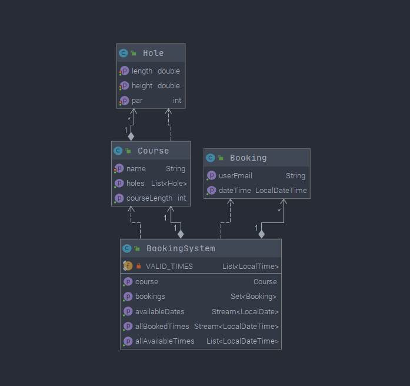

# Project architecture
The project structure is split in three layers: **domain**, **user interface** and **persistence**.
Each layer is well documented and has been tested thoroughly.  
We have decided to split the files into two modules. One module consists of domain
and persistence (core). The other consists of the user interface (gui).  

**CORE**  
[golfapp-core](gr2009/golfapp-core)

**GUI**  
[golfapp-gui](gr2009/golfapp-gui)

## Diagram
