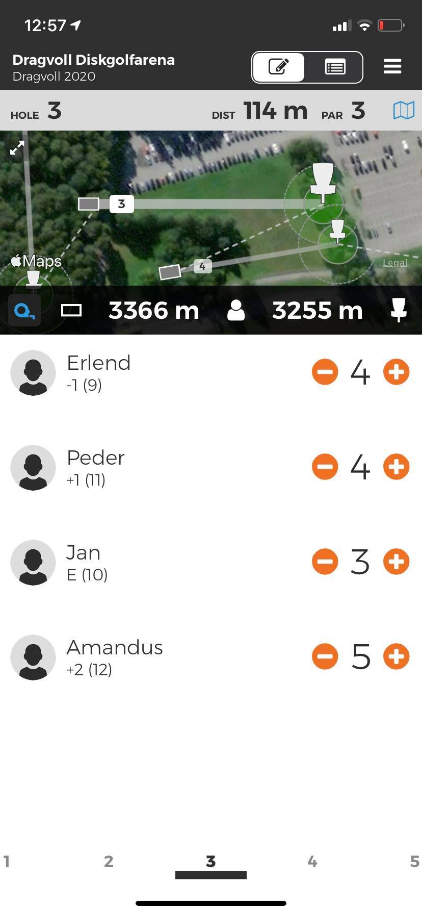
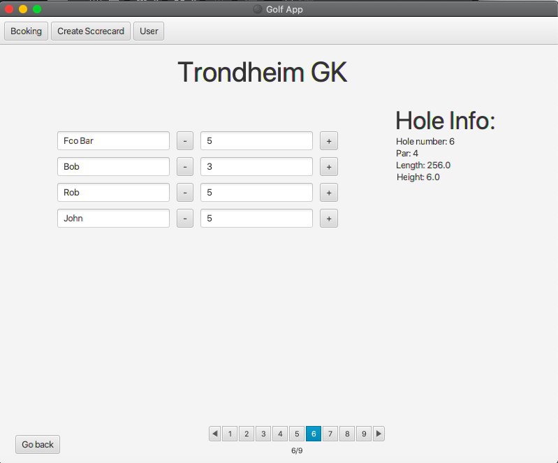

# First user story

As a user I want to track my points while playing.

## Functionality

The users should be able to fill in their score for each hole as they are playing. This is to keep 
track of how the game progresses.

## Screenshot

### Inspiration

### Actual implementation

