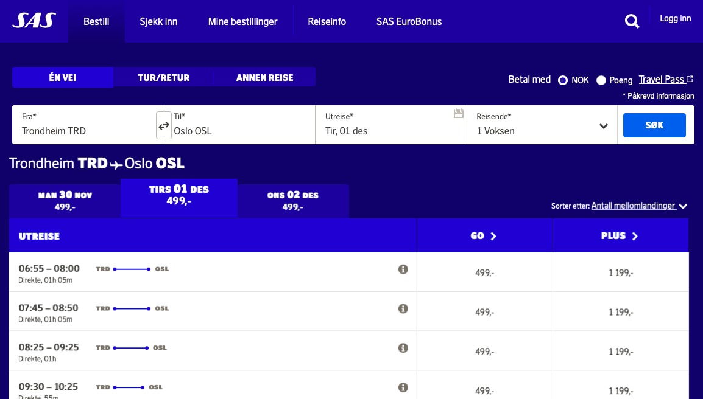
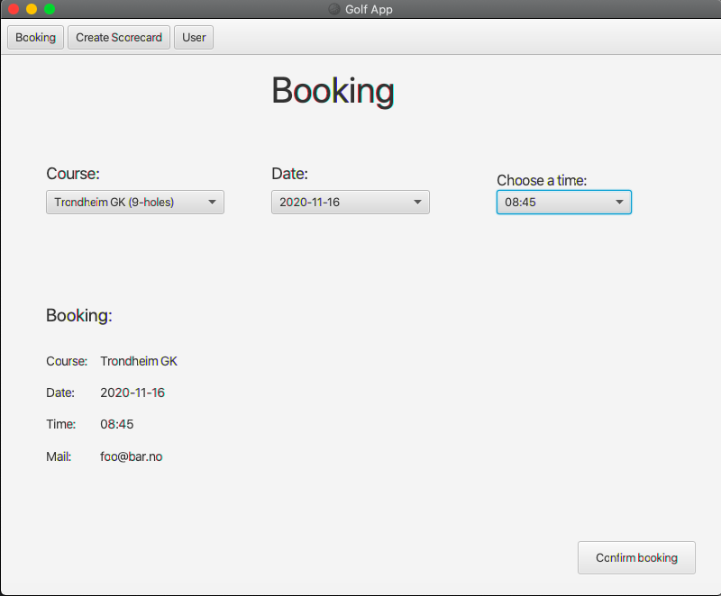

# Second user story

As a user I want to book a time to play.

## Functionality

The users should be able to book a time to play in advance. This is to fill the courses ahead of
time, making planning a game ahead more convenient.

## Screenshot

### Inspiration

### Actual implementation

